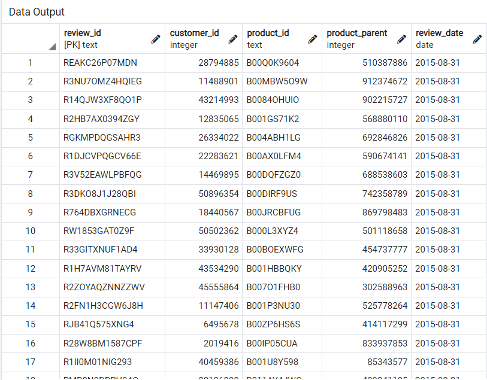
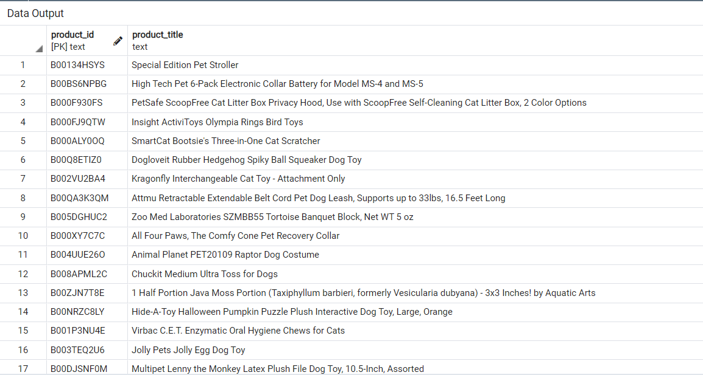
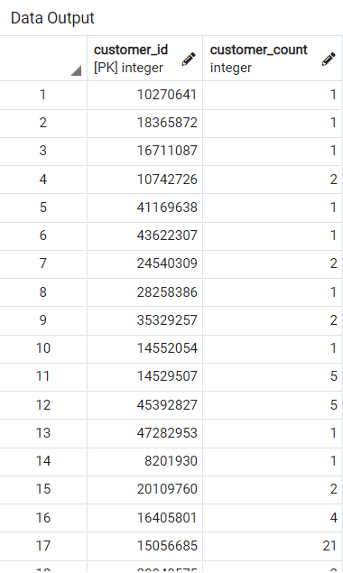
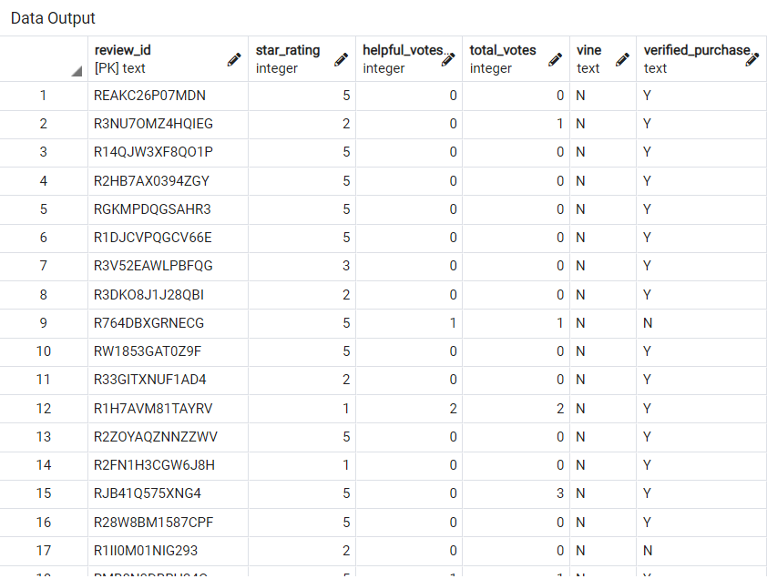

#### Challenge 16: Module 16

# Overview of Project

## Purpose of Amazon Vine Analysis

During module 16, some code using PySpark and SQL was created to analyze some files. The ETL process was used to extract the data from the files, transform the data and connect to an AWS RDS instance. Then, the instance was connected to pgAdmin with a Server. Finally, all the transformed data were loaded to tables in pgAdmin. In this challenge, the steps to address correctly all tasks were the same as in the module but in this case it was about Amazon reviews written by members of Amazon Vine. 
The dataset selected for this work was “Pet Products”, having tons of reviews. The ETL process was made and at the end, an analysis to determine if there was any bias in the review was made with PySpark.

# Results

The ETL process was made correctly. The final table for Reviews Id in pgAdmin can be seen in Image 1.

###### Image 1. Reviews Id.

The table for Products is in Image 2 and the table for Customers is in Image 3.

###### Image 2. Products.

###### Image 3. Customers.

The final table of Vine is located in Image 4. The table was used as a base to filter the Vine and Non-vine reviews, the 5 stars reviews, among others specifications.

###### Image 4. Vine.

## Questions

* How many Vine reviews and non-Vine reviews were there?
The total number of reviews were 38010, where 170 are Vine reviews and 37840 are non-Vine reviews. 

* How many Vine reviews were 5 stars? How many non-Vine reviews were 5 stars?
The total reviews with 5 starts are 20677, while the Vine reviews are 14950 and the Non-Vine reviews are 5727.

* What percentage of Vine reviews were 5 stars? What percentage of non-Vine reviews were 5 stars?
The percentage of Vine reviews with 5 starts is 57% and the percentage of Non-Vine is 58%.

# Summary

In conclusion the analysis doesn’t show a bias. The results show that the Vine program hasn’t a bias in the reviews, at least with the “Pet Products” dataset. It could be a more complete analysis, doing the same steps with different datasets and looking for similarities or any other relation between the results.
